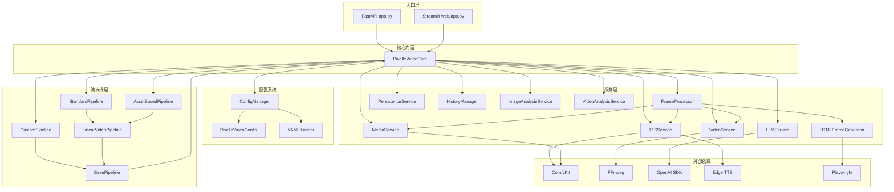
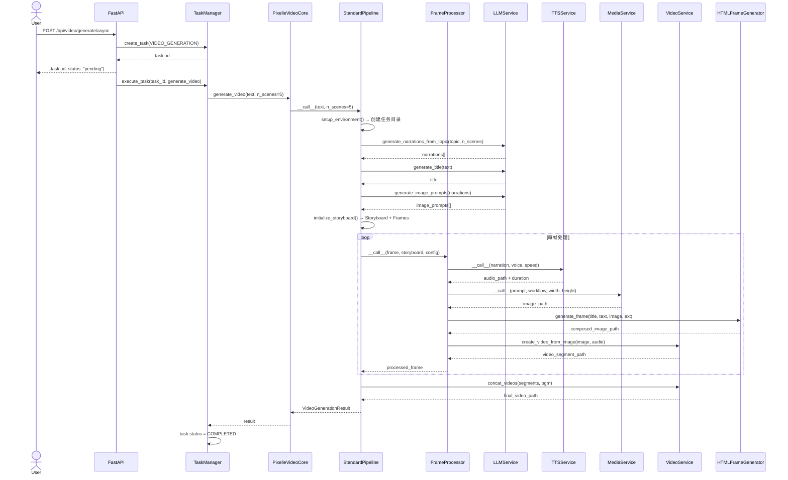

# Pixelle-Video 技术架构分析文档

> **版本**: 0.1.15 | **分析日期**: 2025-07 | **许可**: Apache-2.0

---

## 1. 项目概览

Pixelle-Video 是一个 **AI 驱动的视频生成平台**，属于 Pixelle 生态系统的一部分。核心能力是将文本输入（主题/脚本 + 用户素材）自动转化为带旁白、画面、字幕和背景音乐的完整短视频。

| 维度 | 详情 |
|------|------|
| **语言** | Python ≥ 3.11 |
| **构建系统** | Hatchling (PEP 621) |
| **核心框架** | FastAPI (API) + Streamlit (Web UI) |
| **AI 引擎** | ComfyUI / RunningHub (via ComfyKit) |
| **LLM 集成** | OpenAI SDK (兼容任何 OpenAI-API 格式的 LLM) |
| **TTS 引擎** | Edge TTS (本地) + ComfyUI 工作流 (云端) |
| **视频处理** | FFmpeg (ffmpeg-python) |
| **模板渲染** | Playwright (HTML → PNG 画面合成) |
| **包管理** | uv |

---

## 2. 技术栈总览

```
┌─────────────────────────────────────────────────────┐
│                    前端层                             │
│  Streamlit (Web UI)         FastAPI Swagger/ReDoc    │
├─────────────────────────────────────────────────────┤
│                    API 层                             │
│  FastAPI + CORS + Lifespan + 10 Routers              │
├─────────────────────────────────────────────────────┤
│                   服务层 (Core)                       │
│  PixelleVideoCore → LLM | TTS | Media | Video        │
│                     FrameProcessor | Persistence      │
├─────────────────────────────────────────────────────┤
│                   流水线层                             │
│  BasePipeline → LinearVideoPipeline(Template Method)  │
│     ├── StandardPipeline (主题→视频)                  │
│     ├── CustomPipeline (自定义模板)                   │
│     └── AssetBasedPipeline (用户素材→视频)            │
├─────────────────────────────────────────────────────┤
│                   基础设施层                           │
│  ConfigManager(Singleton) | ComfyKit | FFmpeg         │
│  OpenAI SDK | Edge TTS | Playwright | Pydantic        │
└─────────────────────────────────────────────────────┘
```

### 第三方依赖

| 包名 | 版本 | 用途 |
|------|------|------|
| `fastapi` | ≥0.115.0 | REST API 框架 |
| `uvicorn[standard]` | ≥0.32.0 | ASGI 服务器 |
| `streamlit` | ≥1.40.0 | Web UI 框架 |
| `openai` | ≥2.6.0 | LLM 调用 SDK |
| `comfykit` | ≥0.1.12 | ComfyUI/RunningHub 统一接口 |
| `pydantic` | ≥2.0.0 | 数据校验与配置模型 |
| `pyyaml` | ≥6.0.0 | YAML 配置解析 |
| `edge-tts` | 7.2.7 | 本地文本转语音 |
| `ffmpeg-python` | ≥0.2.0 | 视频处理 |
| `pillow` | ≥10.0.0,<12 | 图像处理 |
| `playwright` | ≥1.58.0 | HTML→PNG 模板渲染 |
| `httpx` | ≥0.28.1 | HTTP 客户端（下载媒体） |
| `loguru` | ≥0.7.0 | 结构化日志 |
| `beautifulsoup4` | ≥4.14.2 | HTML 解析 |
| `moviepy` | 1.0.3 | 视频编辑（辅助） |
| `fastmcp` | ≥2.0.0 | MCP 协议支持 |
| `python-multipart` | ≥0.0.12 | 文件上传 |

---

## 3. 目录结构

```
LY-Pixelle-Video/
├── pixelle_video/               # 核心 Python 包
│   ├── __init__.py              # 公开 API: pixelle_video, PixelleVideoCore
│   ├── service.py               # PixelleVideoCore — 核心服务门面
│   ├── config/                  # 配置系统
│   │   ├── __init__.py          # 公开 config_manager 单例
│   │   ├── schema.py            # Pydantic 配置模型
│   │   ├── manager.py           # ConfigManager（Singleton）
│   │   └── loader.py            # YAML 加载/保存
│   ├── pipelines/               # 视频生成流水线
│   │   ├── __init__.py
│   │   ├── base.py              # BasePipeline 抽象基类
│   │   ├── linear.py            # LinearVideoPipeline + PipelineContext
│   │   ├── standard.py          # StandardPipeline（主题→视频）
│   │   ├── custom.py            # CustomPipeline（可定制模板）
│   │   └── asset_based.py       # AssetBasedPipeline（素材→视频）
│   ├── services/                # 服务层
│   │   ├── llm_service.py       # LLM（OpenAI SDK）
│   │   ├── tts_service.py       # TTS（Edge TTS + ComfyUI 双模式）
│   │   ├── media.py             # 图像/视频生成（ComfyKit）
│   │   ├── video.py             # 视频处理（FFmpeg）
│   │   ├── frame_processor.py   # 帧处理器（4步流水线）
│   │   ├── frame_html.py        # HTML 模板渲染（Playwright）
│   │   ├── comfy_base_service.py # ComfyUI 服务基类
│   │   ├── image_analysis.py    # 图像分析服务
│   │   ├── video_analysis.py    # 视频分析服务
│   │   ├── persistence.py       # 持久化（任务元数据 + 故事板）
│   │   └── history_manager.py   # 历史记录管理
│   ├── models/                  # 数据模型
│   │   ├── storyboard.py        # Storyboard / StoryboardFrame / StoryboardConfig
│   │   └── progress.py          # ProgressEvent
│   ├── utils/                   # 工具函数
│   │   ├── content_generators.py # 内容生成（标题/旁白/图像提示词）
│   │   ├── os_util.py           # 文件路径/任务目录工具
│   │   ├── template_util.py     # 模板解析/类型检测
│   │   ├── prompt_helper.py     # 提示词构建
│   │   ├── tts_util.py          # Edge TTS 调用封装
│   │   ├── workflow_util.py     # 工作流管理与运行
│   │   └── llm_util.py          # LLM 工具函数
│   ├── prompts/                 # LLM 提示词模板
│   └── tts_voices.py            # 语音列表与速率转换
├── api/                         # FastAPI 应用
│   ├── app.py                   # FastAPI 入口（lifespan、路由注册、CORS）
│   ├── config.py                # API 配置
│   ├── dependencies.py          # 依赖注入（pixelle_video 生命周期）
│   ├── routers/                 # API 路由（10 个模块）
│   │   ├── health.py            # GET /health
│   │   ├── llm.py               # POST /api/llm
│   │   ├── tts.py               # POST /api/tts
│   │   ├── image.py             # POST /api/image
│   │   ├── content.py           # POST /api/content/narration
│   │   ├── video.py             # POST /api/video/generate/{sync,async}
│   │   ├── tasks.py             # GET /api/tasks/{id}
│   │   ├── files.py             # GET /api/files/{path}
│   │   ├── resources.py         # GET /api/resources
│   │   └── frame.py             # POST /api/frame/preview
│   └── tasks/                   # 异步任务管理
│       ├── __init__.py
│       ├── manager.py           # TaskManager（内存队列）
│       └── models.py            # Task / TaskStatus / TaskType
├── web/                         # Streamlit Web UI
│   ├── app.py                   # 多页面入口（Home + History）
│   └── pages/
│       ├── 1_🎬_Home.py         # 视频生成主页
│       └── 2_📚_History.py      # 历史记录页
├── templates/                   # HTML 视频帧模板
│   ├── 1080x1920/               # 竖屏 9:16（30+ 模板）
│   ├── 1080x1080/               # 方形 1:1
│   └── 1920x1080/               # 横屏 16:9
├── workflows/                   # ComfyUI 工作流 JSON
├── bgm/                         # 背景音乐资源
├── resources/                   # 静态资源
├── docker-compose.yml           # Docker 部署编排
├── Dockerfile                   # 容器镜像
├── config.example.yaml          # 配置模板
├── pyproject.toml               # 项目元数据与依赖
└── mkdocs.yml                   # 文档站点配置
```

---

## 4. 核心模块深度分析

### 4.1 PixelleVideoCore（服务门面）

`PixelleVideoCore` 是整个系统的中心调度器，采用 **Facade 模式**：

```python
# 单例全局实例
pixelle_video = PixelleVideoCore()

# 使用方式
await pixelle_video.initialize()
answer = await pixelle_video.llm("Explain atomic habits")
audio = await pixelle_video.tts("Hello world")
result = await pixelle_video.generate_video(text="如何提高学习效率", n_scenes=5)
```

**核心属性**：
| 属性 | 类型 | 说明 |
|------|------|------|
| `llm` | LLMService | LLM 文本生成 |
| `tts` | TTSService | 文本转语音 |
| `media` | MediaService | 图像/视频生成 |
| `video` | VideoService | FFmpeg 视频处理 |
| `frame_processor` | FrameProcessor | 逐帧处理管线 |
| `persistence` | PersistenceService | 元数据持久化 |
| `history` | HistoryManager | 历史记录 |
| `pipelines` | dict | 注册的流水线字典 |

**ComfyKit 延迟初始化机制**：
- 首次使用时创建实例（Lazy Initialization）
- 通过 MD5 哈希检测配置变更，自动重建实例（热重载）
- 支持 `async with` 上下文管理器

### 4.2 配置系统

采用三层架构：

```
config.example.yaml → YAML 文件
        ↓
    loader.py (YAML → dict)
        ↓
    schema.py (Pydantic 校验)
        ↓
    manager.py (ConfigManager Singleton)

ConfigManager
├── config: PixelleVideoConfig (Pydantic Model)
│   ├── llm: LLMConfig
│   ├── comfyui: ComfyUIConfig
│   │   ├── tts: TTSSubConfig
│   │   ├── image: ImageSubConfig
│   │   └── video: VideoSubConfig
│   └── template: TemplateConfig
├── reload() — 热重载
├── update(dict) — 深度合并更新
├── save() — 持久化
└── validate() — 完整性检查
```

**设计亮点**：
- **Pydantic v2 验证**：类型安全 + 自动默认值
- **向后兼容**：`config_manager.get("llm.model")` 与 `config_manager.config.llm.model` 并存
- **热重载**：LLM 服务和 ComfyKit 均支持运行时检测配置变更

### 4.3 流水线架构（Pipeline）

#### 类继承层次

```
BasePipeline (ABC)
  ├── __init__(core) — 注入 PixelleVideoCore
  └── __call__(text, progress_callback, **kwargs) → VideoGenerationResult

LinearVideoPipeline (Template Method)
  ├── PipelineContext — 流水线状态容器
  ├── 8 步生命周期:
  │   1. setup_environment()
  │   2. generate_content()
  │   3. determine_title()
  │   4. plan_visuals()
  │   5. initialize_storyboard()
  │   6. produce_assets()
  │   7. post_production()
  │   8. finalize()
  │
  ├── StandardPipeline — 标准"主题→视频"
  ├── CustomPipeline — 可定制模板（开发者友好）
  └── AssetBasedPipeline — 用户上传素材→营销视频
```

#### PipelineContext 数据流

```
PipelineContext
├── 输入: input_text, params, progress_callback
├── 任务: task_id, task_dir
├── 内容: title, narrations[]
├── 视觉: image_prompts[]
├── 配置: config (StoryboardConfig), storyboard (Storyboard)
└── 输出: final_video_path, result (VideoGenerationResult)
```

#### StandardPipeline 执行流程

```
输入文本 (topic 或 script)
    │
    ▼
[Step 1] setup_environment → 创建隔离任务目录
    │
    ▼
[Step 2] generate_content → mode="generate": LLM 生成旁白
                          → mode="fixed": 按段落拆分脚本
    │
    ▼
[Step 3] determine_title → LLM 自动生成标题
    │
    ▼
[Step 4] plan_visuals → 检测模板类型 (image/video/static)
                     → 按需生成图像提示词
    │
    ▼
[Step 5] initialize_storyboard → 创建 Storyboard + N×StoryboardFrame
    │
    ▼
[Step 6] produce_assets → 逐帧处理（支持 RunningHub 并行）
    │                   → FrameProcessor 4 步:
    │                     ① TTS → 音频
    │                     ② Media → 图像/视频
    │                     ③ Compose → HTML 模板渲染
    │                     ④ Video → 图像+音频→视频段
    │
    ▼
[Step 7] post_production → FFmpeg 拼接 + BGM
    │
    ▼
[Step 8] finalize → 创建 VideoGenerationResult + 持久化
```

### 4.4 FrameProcessor（帧处理核心）

四步流水线，将单个 StoryboardFrame 转化为视频段：

```
FrameProcessor.__call__(frame, storyboard, config)
│
├─ Step 1: _step_generate_audio()
│   └─ TTS(local: Edge TTS / comfyui: workflow) → .mp3
│   └─ ffprobe 获取音频时长 → frame.duration
│
├─ Step 2: _step_generate_media() [条件执行]
│   └─ 仅当 frame.image_prompt is not None 时执行
│   └─ MediaService(prompt, workflow, width, height) → image/video
│   └─ httpx 下载到本地 → frame.image_path / frame.video_path
│
├─ Step 3: _step_compose_frame()
│   └─ HTMLFrameGenerator.generate_frame()
│   └─ Playwright 渲染 HTML 模板 → PNG
│   └─ 模板变量: {{title}}, {{text}}, {{image}}, {{ext.*}}
│
├─ Step 4: _step_create_video_segment()
│   ├─ video 媒体: overlay HTML → FFmpeg merge audio
│   └─ image/None 媒体: image + audio → video segment
│
└─ 返回: frame (含 audio_path, image_path, composed_image_path, video_segment_path)
```

### 4.5 视频处理服务（VideoService）

基于 `ffmpeg-python` 的高性能视频处理：

| 方法 | 功能 | 算法 |
|------|------|------|
| `concat_videos()` | 拼接多段视频 | demuxer (流拷贝) 或 filter (重编码) |
| `merge_audio_video()` | 合并音视频 | 智能时长适配：pad/trim/freeze |
| `create_video_from_image()` | 静态图→视频 | 循环图像 + 精确音频时长 |
| `add_bgm()` | 添加背景音乐 | amix 混音 + 循环 + 淡入淡出 |
| `overlay_image_on_video()` | 图像叠加视频 | contain/cover/stretch 缩放模式 |

**智能时长适配算法**：
- `video < audio`：pad 视频（freeze 最后一帧 或 black）
- `video > audio + tolerance`：trim 视频
- `video ≈ audio (±0.3s)`：保持原样

### 4.6 LLM 服务

```
LLMService.__call__(prompt, temperature, max_tokens, response_type)
│
├─ 每次调用动态创建 AsyncOpenAI 客户端（支持参数覆盖）
├─ 配置优先级: 方法参数 > ConfigManager > 默认值
│
├─ 标准文本模式: chat.completions.create() → str
│
└─ 结构化输出模式 (response_type=PydanticModel):
    ├─ 生成 JSON Schema → 拼接到 prompt
    ├─ 智能 JSON 提取（直接解析 → markdown block → 花括号定位）
    └─ model_validate() → Pydantic Model 实例
```

**支持的 LLM 提供商**：OpenAI、阿里 Qwen、Anthropic Claude、DeepSeek、Moonshot Kimi、Ollama（本地免费）

### 4.7 TTS 服务

双模式架构：

```
TTSService.__call__(text, inference_mode, voice, speed)
│
├─ mode="local" (默认):
│   └─ Edge TTS (edge-tts 7.2.7)
│   └─ 中文默认语音: zh-CN-YunjianNeural
│   └─ 速率转换: speed → rate 参数
│
└─ mode="comfyui":
    └─ ComfyKit 执行 TTS 工作流
    ├─ 支持 selfhost (本地 ComfyUI) 和 runninghub (云端)
    └─ 自动下载远程音频文件到本地
```

---

## 5. 数据模型

### StoryboardConfig（故事板配置）

```
@dataclass
class StoryboardConfig:
    media_width: int              # 媒体宽度（必需）
    media_height: int             # 媒体高度（必需）
    task_id: Optional[str]        # 任务隔离 ID
    n_storyboard: int = 5         # 帧数
    min_narration_words: int = 5  # 最小旁白字数
    max_narration_words: int = 20 # 最大旁白字数
    min_image_prompt_words: int = 30
    max_image_prompt_words: int = 60
    video_fps: int = 30
    tts_inference_mode: str = "local"
    voice_id: Optional[str]
    tts_workflow: Optional[str]
    tts_speed: Optional[float]
    ref_audio: Optional[str]      # 参考音频（声音克隆）
    media_workflow: Optional[str]
    frame_template: str = "1080x1920/default.html"
    template_params: Optional[Dict]
```

### StoryboardFrame（故事板帧）

```
@dataclass
class StoryboardFrame:
    index: int                    # 帧序号 (0-based)
    narration: str                # 旁白文本
    image_prompt: str             # 图像提示词
    audio_path: Optional[str]     # 音频路径
    media_type: Optional[str]     # "image" | "video"
    image_path: Optional[str]     # 图像路径
    video_path: Optional[str]     # 视频路径
    composed_image_path: Optional[str]  # 合成图像
    video_segment_path: Optional[str]   # 视频段
    duration: float = 0.0
    created_at: Optional[datetime]
```

### Storyboard → VideoGenerationResult

```
Storyboard
├── title: str
├── config: StoryboardConfig
├── frames: List[StoryboardFrame]
├── content_metadata: Optional[ContentMetadata]
├── final_video_path: Optional[str]
├── total_duration: float
├── is_completed → bool
└── progress → float (0.0-1.0)

VideoGenerationResult
├── video_path: str
├── storyboard: Storyboard
├── duration: float
├── file_size: int
└── created_at: datetime
```

---

## 6. API 层架构

### FastAPI 路由表

| 方法 | 路径 | 功能 |
|------|------|------|
| `GET` | `/` | API 信息 |
| `GET` | `/health` | 健康检查 |
| `POST` | `/api/llm` | LLM 文本生成 |
| `POST` | `/api/tts` | 文本转语音 |
| `POST` | `/api/image` | 图像生成 |
| `POST` | `/api/content/narration` | 内容生成 |
| `POST` | `/api/video/generate/sync` | 同步视频生成 |
| `POST` | `/api/video/generate/async` | 异步视频生成（返回 task_id） |
| `GET` | `/api/video/status/{task_id}` | 任务状态查询 |
| `GET` | `/api/tasks/{task_id}` | 任务详情 |
| `GET` | `/api/tasks` | 任务列表 |
| `DELETE` | `/api/tasks/{task_id}` | 取消任务 |
| `GET` | `/api/files/{path}` | 文件下载 |
| `GET` | `/api/resources/{type}` | 资源列表（BGM/模板/工作流） |
| `POST` | `/api/frame/preview` | 帧预览 |

### 中间件

- **CORS**：可配置跨域（默认开启，支持所有来源）
- **Lifespan**：启动时初始化 TaskManager + 关闭时清理资源

### TaskManager（异步任务系统）

```
TaskManager (In-Memory)
├── create_task() → Task (PENDING)
├── execute_task(coro_func) → asyncio.create_task()
├── get_task() / list_tasks()
├── update_progress(current, total, message)
├── cancel_task() → CANCELLED
└── _cleanup_loop() → 定时清理过期任务
```

**任务生命周期**：`PENDING → RUNNING → COMPLETED / FAILED / CANCELLED`

---

## 7. Web 前端（Streamlit）

基于 Streamlit 的多页面应用：

```
web/app.py (st.navigation)
├── pages/1_🎬_Home.py    — 视频生成主页
└── pages/2_📚_History.py — 历史记录浏览
```

**首页功能**：
- LLM 配置面板（API Key、Base URL、Model）
- ComfyUI 配置面板（URL、API Key、RunningHub Key）
- 视频生成控制台（模式选择、模板选择、场景数、BGM）
- 实时进度条
- 视频预览与下载

---

## 8. 模板系统

### 模板文件命名约定

| 前缀 | 类型 | 说明 |
|------|------|------|
| `image_*.html` | 图像模板 | 需要 AI 生成图像（含 `{{image}}` 占位符） |
| `video_*.html` | 视频模板 | 需要 AI 生成视频 |
| `static_*.html` | 静态模板 | 纯文字排版，无需媒体生成 |
| `asset_default.html` | 素材模板 | 用于 AssetBasedPipeline |

### 模板变量系统

```html
<!-- 模板支持的变量 -->
{{title}}       — 视频标题
{{text}}        — 旁白/字幕文本
{{image}}       — 媒体文件路径（图像或视频）
{{ext.index}}   — 帧序号
{{ext.*}}       — 自定义参数（如 accent_color）
```

### 模板渲染流程

```
HTML 模板 (Jinja2-like)
    ↓
HTMLFrameGenerator.generate_frame()
    ↓
Playwright (无头浏览器) 渲染
    ↓
截图 → PNG
```

---

## 9. 设计模式总结

| 模式 | 应用位置 | 说明 |
|------|----------|------|
| **Facade** | PixelleVideoCore | 统一门面，隐藏服务复杂性 |
| **Singleton** | ConfigManager / pixelle_video / task_manager | 全局唯一实例 |
| **Template Method** | LinearVideoPipeline | 8 步固定骨架，子类覆写步骤 |
| **Strategy** | Pipeline 多实现 | Standard / Custom / AssetBased |
| **Observer** | ProgressEvent + callback | 进度通知机制 |
| **Lazy Initialization** | ComfyKit | 首次使用时创建 + 配置变更检测 |
| **Dependency Injection** | FastAPI lifespan | 生命周期管理 |

---

## 10. 依赖拓扑（Mermaid）



---

## 11. 关键调用流程（Mermaid 序列图）



---

## 12. 配置与扩展性

### 配置热重载

- `ConfigManager.reload()` 触发全量重载
- `LLMService` 每次调用动态读取最新配置
- `ComfyKit` 通过 MD5 哈希检测变更并自动重建

### 流水线注册

```python
# 动态注册自定义流水线
from pixelle_video.pipelines.custom import CustomPipeline
pixelle_video.pipelines["my_pipeline"] = CustomPipeline(pixelle_video)

# 通过参数选择流水线
result = await pixelle_video.generate_video(
    text=content,
    pipeline="my_pipeline",
    custom_param="value"
)
```

### 模板扩展

- 按目录约定组织：`templates/{WIDTH}x{HEIGHT}/{type}_{style}.html`
- 支持的模板类型：`image_`、`video_`、`static_`、`asset_`
- 通过 `template_util.get_template_type()` 自动检测

---

## 13. 部署架构

```yaml
# docker-compose.yml 定义的服务
services:
  pixelle-video:    # 主应用 (FastAPI + Streamlit)
    ports: "8000:8000"
    volumes: config.yaml + output/
  comfyui:          # AI 引擎 (可选，selfhost 模式)
    ports: "8188:8188"
    runtime: nvidia  # GPU 支持
```

**两种运行模式**：
1. **RunningHub 云端**（推荐）：无需本地 GPU，通过 API Key 调用云端 ComfyUI
2. **Selfhost 本地**：需要 NVIDIA GPU，Docker 部署 ComfyUI

---

## 14. 架构亮点与改进建议

### ✅ 亮点

1. **清晰的分层架构**：Facade → Pipeline → Service → Utils，职责分明
2. **Template Method 模式**：LinearVideoPipeline 提供统一骨架，子类灵活覆写
3. **智能模板检测**：自动跳过不需要媒体生成的静态模板，节省成本
4. **RunningHub 并行处理**：Semaphore 控制并发，显著提升批量帧处理速度
5. **配置热重载**：无需重启即可切换 LLM 提供商或 ComfyUI 配置
6. **结构化输出**：LLMService 支持 Pydantic 模型解析，兼容所有 OpenAI-API 格式提供商

### 🔧 改进建议

1. **TaskManager 持久化**：当前为内存存储，服务重启丢失所有任务。建议引入 Redis/DB
2. **PipelineContext 类型安全**：部分属性通过 `hasattr` 动态赋值（如 `ctx.request`），可考虑明确定义
3. **CustomPipeline 代码重复**：与 StandardPipeline 存在大量相似逻辑，可抽取公共方法
4. **错误恢复**：FrameProcessor 缺少单帧失败后的重试机制
5. **测试覆盖**：未发现单元测试文件（tests/ 目录未在源码中体现）

---

> **生成时间**: 2025-07 | **分析工具**: 源码静态分析 | **项目**: Pixelle-Video v0.1.15
