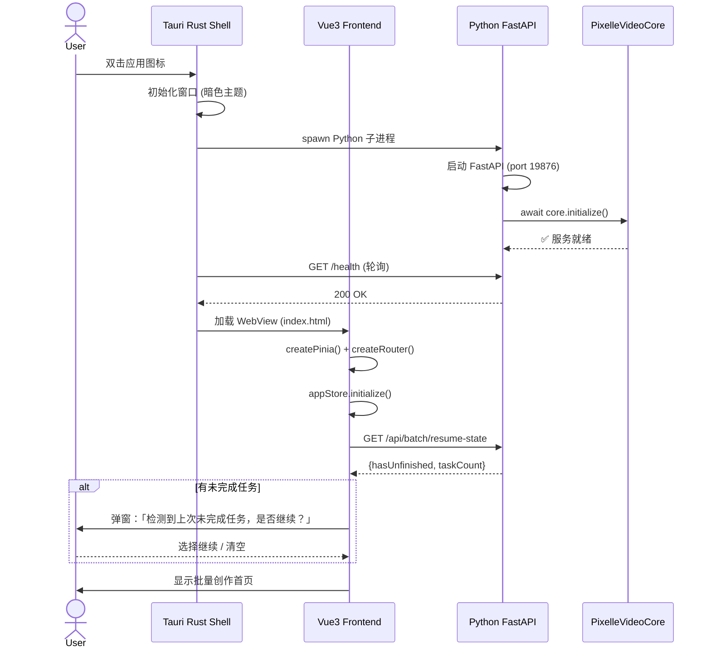
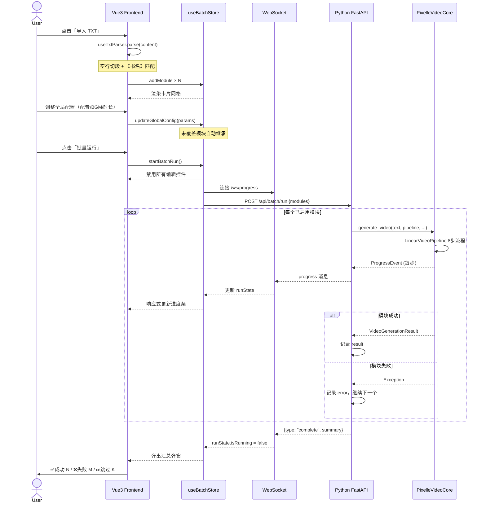
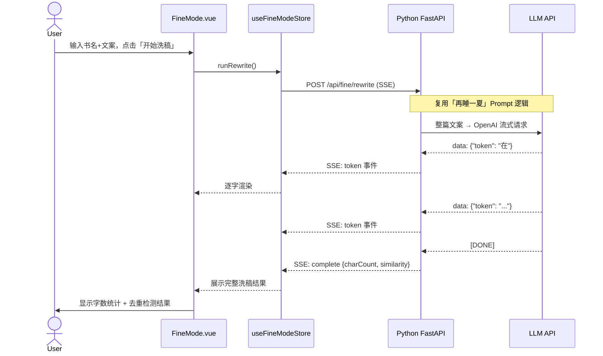
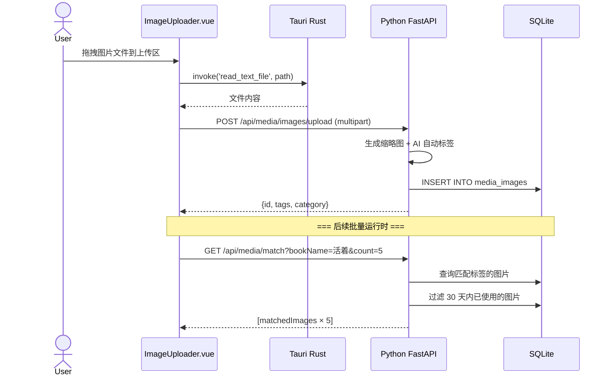
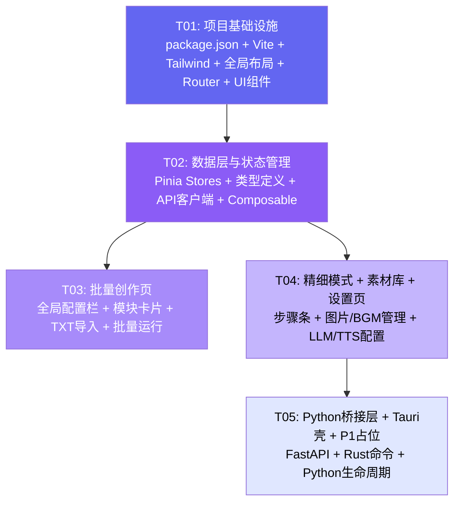

# Pixelle-Video 桌面应用 — 系统架构设计

> **架构师**：Bob（高见远）  
> **日期**：2025-05-19  
> **版本**：v1.0  
> **项目代号**：pixelle_video_desktop

---

## 目录

1. [实现方案](#1-实现方案)
2. [文件列表](#2-文件列表)
3. [数据结构与接口](#3-数据结构与接口)
4. [程序调用流程](#4-程序调用流程)
5. [待明确事项](#5-待明确事项)
6. [依赖包列表](#6-依赖包列表)
7. [任务列表](#7-任务列表)
8. [共享知识](#8-共享知识)
9. [任务依赖图](#9-任务依赖图)

---

## 1. 实现方案

### 1.1 整体架构

```
┌─────────────────────────────────────────────────────────────┐
│                     Tauri 2.0 桌面壳                          │
│  ┌──────────────────────┐    ┌─────────────────────────────┐ │
│  │   Vue3 前端 (WebView) │    │   Rust 后端 (tauri::command) │ │
│  │                      │    │                             │ │
│  │  Shadcn-Vue + TW     │◄──►│  • spawn / kill Python 进程   │ │
│  │  Pinia 状态管理       │IPC │  • 原生文件对话框             │ │
│  │  Vue Router 路由      │    │  • 系统托盘 & 窗口管理        │ │
│  └──────────┬───────────┘    └──────────────┬──────────────┘ │
│             │                               │                 │
│             │  HTTP / WebSocket (localhost) │ spawn           │
│             │                               ▼                 │
│             │              ┌──────────────────────────────┐   │
│             └──────────────►  Python FastAPI 桥接服务器      │   │
│                            │  (localhost:19876)            │   │
│                            │                              │   │
│                            │  • REST API (CRUD + 操作)     │   │
│                            │  • WebSocket (进度推送)        │   │
│                            │  • SSE (流式输出)              │   │
│                            └──────────────┬───────────────┘   │
│                                           │                    │
└───────────────────────────────────────────┼────────────────────┘
                                            │ Python import
                                            ▼
              ┌─────────────────────────────────────────────┐
              │           PixelleVideoCore (地基红线)         │
              │                                             │
              │  ┌──────────┐ ┌──────────┐ ┌─────────────┐  │
              │  │LLMService│ │TTSService│ │MediaService │  │
              │  └──────────┘ └──────────┘ └─────────────┘  │
              │  ┌──────────┐ ┌──────────────────────────┐  │
              │  │VideoSvc  │ │ LinearVideoPipeline      │  │
              │  └──────────┘ │ (Template Method 8步骤)   │  │
              │               └──────────────────────────┘  │
              │  不可修改 ←────────────────────→ 可扩展子类  │
              └─────────────────────────────────────────────┘
```

**三层分离原则**：

| 层 | 技术 | 职责 | 通信方式 |
|----|------|------|----------|
| **表现层** | Vue3 + Shadcn-Vue + Tailwind | UI 渲染、用户交互、状态管理 | ↔ Rust via Tauri IPC |
| **壳层** | Tauri 2.0 (Rust) | 窗口管理、Python 生命周期、原生能力 | ↔ Python via HTTP/Process |
| **引擎层** | Python FastAPI + PixelleVideoCore | 视频生成、AI 调用、素材管理 | HTTP REST + WebSocket |

### 1.2 核心技术挑战与选型

| # | 挑战 | 方案 | 理由 |
|---|------|------|------|
| 1 | **前端↔Python 通信** | Tauri Rust spawn Python FastAPI 子进程，前端通过 HTTP/WS 直连 localhost | 避免 Rust-Python FFI 复杂性；FastAPI 已在依赖中；WebSocket 原生支持流式进度 |
| 2 | **流式输出（洗稿）** | FastAPI SSE (Server-Sent Events) | 前端 EventSource 原生支持，LLM token 级实时展示 |
| 3 | **批量运行进度** | WebSocket 双向通道 | 长任务进度推送 + 前端可发送取消指令 |
| 4 | **Python 生命周期管理** | Rust `std::process::Command` spawn + port 健康检查 | Tauri 启动时自动拉起，退出时 kill；崩溃自动重启 |
| 5 | **素材库持久化** | SQLite (via `better-sqlite3` 或 Rust `rusqlite`) + 文件系统 | 轻量无服务依赖，桌面应用首选 |
| 6 | **暗色主题** | Tailwind `class` 模式 + CSS 变量 | shadcn-vue 原生支持，与参考 UI 一致 |
| 7 | **大文件处理** | Rust sidecar 处理文件复制/导入 | 避免 WebView 的 File API 性能限制 |

### 1.3 框架与库选型

| 类别 | 选型 | 版本 | 说明 |
|------|------|------|------|
| 桌面壳 | Tauri | 2.x | Rust 原生，体积小（~10MB），跨平台 |
| 前端框架 | Vue | 3.4+ | Composition API + `<script setup>` |
| 构建工具 | Vite | 5.x | Tauri 官方推荐 |
| UI 组件库 | shadcn-vue | latest | 无包依赖，复制源码，与参考 UI 一致 |
| CSS 框架 | Tailwind CSS | 3.4+ | 原子化 CSS，与 shadcn-vue 深度绑定 |
| 状态管理 | Pinia | 2.x | Vue 3 官方推荐 |
| 路由 | Vue Router | 4.x | SPA 路由 |
| 图标 | Lucide Vue | latest | shadcn-vue 默认图标集 |
| 工具库 | @vueuse/core | latest | 组合式工具函数 |
| 后端框架 | FastAPI | 已在 pyproject.toml | REST + WebSocket + SSE 一体 |
| 数据库 | SQLite | 内置 (sqlite3) | Python 标准库，零配置 |
| Python 进程管理 | Rust std::process | - | Tauri 内建 |

---

## 2. 文件列表

### 2.1 完整目录结构

```
D:\全自动的开始\LY-Pixelle-Video\
│
├── pixelle_video/                  # [已有] Python 引擎 - 地基红线
│   ├── __init__.py
│   ├── service.py                  # PixelleVideoCore
│   ├── pipelines/
│   │   ├── base.py                 # BasePipeline
│   │   ├── linear.py               # LinearVideoPipeline
│   │   ├── standard.py
│   │   ├── custom.py
│   │   └── asset_based.py
│   ├── services/                   # LLM/TTS/Media/Video 服务
│   ├── models/                     # Storyboard, Progress, Media
│   ├── config/                     # 配置管理
│   ├── prompts/                    # Prompt 模板
│   └── utils/                      # 工具函数
│
├── python_server/                  # [新建] Python FastAPI 桥接层
│   ├── __init__.py
│   ├── main.py                     # 入口：FastAPI app + 生命周期
│   ├── config.py                   # 端口/路径配置
│   ├── routes/
│   │   ├── __init__.py
│   │   ├── batch.py                # /api/batch/* 批量创作
│   │   ├── fine_mode.py            # /api/fine/*  精细模式
│   │   ├── media.py                # /api/media/* 素材库
│   │   ├── settings.py             # /api/settings/* 设置
│   │   └── ws.py                   # /ws/progress WebSocket
│   ├── models/
│   │   ├── __init__.py
│   │   ├── requests.py             # Pydantic 请求模型
│   │   └── responses.py            # Pydantic 响应模型
│   ├── services/
│   │   ├── __init__.py
│   │   ├── batch_service.py        # 批量运行编排逻辑
│   │   ├── rewrite_service.py      # 洗稿服务（SSE 流式）
│   │   ├── media_service.py        # 素材库管理
│   │   └── progress_tracker.py     # 进度追踪器
│   └── db/
│       ├── __init__.py
│       ├── database.py             # SQLite 连接管理
│       ├── models.py               # ORM 模型 (素材、任务记录)
│       └── migrations.py           # 首次建表
│
├── src-tauri/                      # [新建] Tauri Rust 壳
│   ├── Cargo.toml
│   ├── tauri.conf.json
│   ├── build.rs
│   ├── icons/                      # 应用图标
│   ├── src/
│   │   ├── main.rs                 # 入口：不显示主窗口，直接启动 WebView
│   │   ├── lib.rs                  # Tauri plugin 注册
│   │   ├── commands.rs             # #[tauri::command] IPC 处理器
│   │   ├── python_manager.rs       # Python 子进程生命周期管理
│   │   └── db.rs                   # Rust 侧 SQLite (进度持久化)
│   └── capabilities/
│       └── default.json            # Tauri 权限声明
│
├── src/                            # [新建] Vue3 前端
│   ├── main.ts                     # Vue 应用入口
│   ├── App.vue                     # 根组件（布局壳）
│   ├── style.css                   # 全局样式 + Tailwind 指令
│   │
│   ├── router/
│   │   └── index.ts                # Vue Router 路由配置
│   │
│   ├── stores/                     # Pinia 状态管理
│   │   ├── index.ts                # Pinia 实例创建
│   │   ├── batch.ts                # 批量创作状态
│   │   ├── fineMode.ts             # 精细模式状态
│   │   ├── media.ts                # 素材库状态
│   │   ├── settings.ts             # 设置状态（持久化）
│   │   └── app.ts                  # 全局状态（Python 连接、运行状态）
│   │
│   ├── views/                      # 路由页面
│   │   ├── BatchCreation.vue       # P0: 批量创作页（默认首页）
│   │   ├── FineMode.vue            # P0: 精细模式页
│   │   ├── TemplateCanvas.vue      # P1: 模板画板（占位）
│   │   ├── MediaLibrary.vue        # P0: 素材库（图片+BGM 子标签）
│   │   ├── CopyLibrary.vue         # P1: 文案库（占位）
│   │   └── Settings.vue            # P0: 设置页
│   │
│   ├── components/
│   │   ├── layout/
│   │   │   ├── AppLayout.vue       # 全局布局（左侧导航 + 右侧内容区）
│   │   │   ├── AppSidebar.vue      # 160px 深色导航栏
│   │   │   └── TopBar.vue          # 可选的顶栏（Python 连接状态指示）
│   │   │
│   │   ├── batch/
│   │   │   ├── GlobalConfigBar.vue # 顶部全局参数配置栏
│   │   │   ├── ModuleCard.vue      # 单书模块卡片
│   │   │   ├── ModuleList.vue      # 卡片网格容器
│   │   │   ├── TxtImportDialog.vue # TXT 批量导入对话框
│   │   │   ├── BatchRunPanel.vue   # 批量运行面板（进度条+状态）
│   │   │   └── ResumeDialog.vue    # 未完成任务恢复弹窗
│   │   │
│   │   ├── fine/
│   │   │   ├── StepIndicator.vue   # 步骤指示器
│   │   │   ├── RewritePanel.vue    # 洗稿环节面板
│   │   │   ├── VoicePanel.vue      # 配音环节面板
│   │   │   ├── ImagePanel.vue      # 配图环节面板
│   │   │   └── VideoPanel.vue      # 视频生成+预览面板
│   │   │
│   │   ├── media/
│   │   │   ├── ImageGrid.vue       # 图片网格展示
│   │   │   ├── ImageUploader.vue   # 图片拖拽上传区
│   │   │   ├── ImageDetail.vue     # 图片详情（标签编辑）
│   │   │   ├── BgmList.vue         # BGM 列表
│   │   │   ├── BgmUploader.vue     # BGM 上传
│   │   │   └── CategoryFilter.vue  # 分类筛选器
│   │   │
│   │   ├── settings/
│   │   │   ├── LlmConfig.vue       # LLM API 配置卡片
│   │   │   ├── TtsConfig.vue       # TTS API 配置卡片
│   │   │   ├── ComfyUIConfig.vue   # ComfyUI 本地配置卡片
│   │   │   └── OutputPathConfig.vue # 输出路径配置
│   │   │
│   │   └── ui/                     # shadcn-vue 组件（按需复制）
│   │       ├── Button.vue
│   │       ├── Card.vue
│   │       ├── Dialog.vue
│   │       ├── Input.vue
│   │       ├── Select.vue
│   │       ├── Slider.vue
│   │       ├── Switch.vue
│   │       ├── Tabs.vue
│   │       ├── Progress.vue
│   │       ├── Badge.vue
│   │       ├── Separator.vue
│   │       ├── Tooltip.vue
│   │       ├── ScrollArea.vue
│   │       └── Textarea.vue
│   │
│   ├── composables/                # 组合式函数
│   │   ├── useApi.ts               # HTTP 请求封装
│   │   ├── useWebSocket.ts         # WebSocket 连接管理
│   │   ├── useTauriCommand.ts      # Tauri invoke 封装
│   │   └── useTxtParser.ts         # TXT 解析逻辑
│   │
│   ├── lib/
│   │   ├── api.ts                  # API 端点定义
│   │   ├── constants.ts            # 常量（端口、分类等）
│   │   └── utils.ts                # 通用工具函数
│   │
│   └── types/
│       ├── index.ts                # 类型导出汇总
│       ├── batch.ts                # 批量创作类型
│       ├── media.ts                # 素材库类型
│       ├── settings.ts             # 设置类型
│       └── api.ts                  # API 请求/响应类型
│
├── index.html                      # Vite 入口 HTML
├── package.json                    # Node.js 依赖
├── vite.config.ts                  # Vite 配置
├── tsconfig.json                   # TypeScript 配置
├── tailwind.config.ts              # Tailwind 配置
├── postcss.config.js               # PostCSS 配置
└── components.json                 # shadcn-vue 配置
```

### 2.2 文件清单（按模块）

| 模块 | 文件数 | 说明 |
|------|--------|------|
| 项目基础设施 | 7 | package.json, vite/tailwind/ts 配置, index.html, main.ts, App.vue, style.css |
| Tauri Rust 壳 | 9 | Cargo.toml, tauri.conf.json, build.rs, icons/, main.rs, lib.rs, commands.rs, python_manager.rs, db.rs, capabilities/ |
| 路由 & 布局 | 4 | router/index.ts, AppLayout.vue, AppSidebar.vue, TopBar.vue |
| 状态管理 | 6 | Pinia stores: index, batch, fineMode, media, settings, app |
| 类型定义 | 5 | types: index, batch, media, settings, api |
| API & 组合式函数 | 6 | composables(4) + lib/api.ts + lib/utils.ts |
| 批量创作 | 7 | BatchCreation.vue + 6 子组件 |
| 精细模式 | 6 | FineMode.vue + 5 子组件 |
| 素材库 | 8 | MediaLibrary.vue + 6 子组件 + categoryFilter |
| 设置页 | 5 | Settings.vue + 4 配置子组件 |
| P1 占位 | 2 | TemplateCanvas.vue, CopyLibrary.vue |
| shadcn-vue UI | 13 | Button, Card, Dialog, Input, Select, Slider, Switch, Tabs, Progress, Badge, Separator, Tooltip, ScrollArea, Textarea |
| Python 桥接层 | 15 | main.py + routes/ + models/ + services/ + db/ |
| **合计** | **~70** | |

---

## 3. 数据结构与接口

### 3.1 前端核心类型（TypeScript）

> 完整类图见 `docs/class-diagram.mermaid`

```mermaid
classDiagram
    direction TB

    %% ========== 批量创作 ==========
    class BatchModule {
        +string id
        +string bookName
        +string content
        +boolean enabled
        +ModuleParams params
        +ModuleStatus status
        +string? errorMessage
        +number createdAt
    }

    class ModuleParams {
        +string voice
        +string bgm
        +number[] durationRange
        +string style
        +number rewriteStrength
        +number targetWordCount
        +number matchMaterialCount
    }

    class GlobalConfig {
        +string voice
        +string bgm
        +number durationMin
        +number durationMax
        +string style
    }

    class ModuleStatus {
        <<enumeration>>
        idle
        running
        success
        failed
        skipped
    }

    class BatchRunState {
        +boolean isRunning
        +number totalModules
        +number completedCount
        +number failedCount
        +number skippedCount
        +string? currentBookName
        +number progress
        +ModuleResult[] results
    }

    class ModuleResult {
        +string moduleId
        +string bookName
        +ModuleStatus status
        +string? errorMessage
        +string? videoPath
    }

    %% ========== 精细模式 ==========
    class FineModeState {
        +string bookName
        +string content
        +FineStep currentStep
        +string rewrittenContent
        +string audioPath
        +string[] imagePaths
        +string videoPath
        +boolean isProcessing
    }

    class FineStep {
        <<enumeration>>
        rewrite
        voice
        image
        video
    }

    %% ========== 素材库 ==========
    class MediaImage {
        +string id
        +string filename
        +string path
        +ImageCategory category
        +string source
        +string[] tags
        +string? lastUsedAt
        +string createdAt
        +number fileSize
        +number width
        +number height
    }

    class ImageCategory {
        <<enumeration>>
        nature
        studio
        study
        abstract
        uncategorized
    }

    class BgmTrack {
        +string id
        +string name
        +string path
        +BgmCategory category
        +boolean builtin
        +number fadeIn
        +number fadeOut
        +number duration
    }

    class BgmCategory {
        <<enumeration>>
        intense
        calm
    }

    %% ========== 设置 ==========
    class AppSettings {
        +LLMConfig llm
        +TTSConfig tts
        +ComfyUIConfig comfyUI
        +string outputPath
    }

    class LLMConfig {
        +string apiUrl
        +string apiKey
        +string model
        +string provider
    }

    class TTSConfig {
        +string mode
        +string mimoApiUrl
        +string mimoApiKey
        +string voiceId
    }

    class ComfyUIConfig {
        +string comfyuiUrl
        +string comfyuiApiKey
        +boolean localMode
    }

    %% ========== Pinia Stores ==========
    class useBatchStore {
        +GlobalConfig globalConfig
        +BatchModule[] modules
        +BatchRunState runState
        +addModule(bookName, content?) void
        +removeModule(id) void
        +toggleModule(id) void
        +updateModuleParams(id, params) void
        +importFromTxt(content) ImportResult
        +syncSameNameModules(bookName) void
        +startBatchRun() Promise~void~
        +resumeBatchRun() Promise~void~
        +clearCompleted() void
    }

    class useFineModeStore {
        +FineModeState state
        +setBook(bookName, content) void
        +runRewrite() Promise~void~
        +runVoice() Promise~void~
        +runImage() Promise~void~
        +runVideo() Promise~void~
        +goToStep(step) void
    }

    class useMediaStore {
        +MediaImage[] images
        +BgmTrack[] bgms
        +string activeTab
        +ImageCategory imageFilter
        +BgmCategory bgmFilter
        +uploadImages(files) Promise~void~
        +uploadBgm(file) Promise~void~
        +updateTags(id, tags) void
        +deleteImage(id) void
        +deleteBgm(id) void
    }

    class useSettingsStore {
        +AppSettings settings
        +boolean isLoaded
        +loadSettings() Promise~void~
        +saveSettings() Promise~void~
        +testLlmConnection() Promise~boolean~
        +testTtsConnection() Promise~boolean~
        +downloadComfyUI() Promise~void~
    }

    class useAppStore {
        +boolean pythonReady
        +string pythonStatus
        +boolean isFirstLaunch
        +initialize() Promise~void~
        +checkPythonHealth() Promise~boolean~
    }

    %% ========== 关系 ==========
    BatchModule "1" --> "1" ModuleParams : params
    BatchModule --> ModuleStatus : status
    BatchRunState "1" --> "*" ModuleResult : results
    useBatchStore "1" --> "1" GlobalConfig : globalConfig
    useBatchStore "1" --> "*" BatchModule : modules
    useBatchStore "1" --> "1" BatchRunState : runState
    useFineModeStore "1" --> "1" FineModeState : state
    FineModeState --> FineStep : currentStep
    useMediaStore "1" --> "*" MediaImage : images
    useMediaStore "1" --> "*" BgmTrack : bgms
    MediaImage --> ImageCategory : category
    BgmTrack --> BgmCategory : category
    useSettingsStore "1" --> "1" AppSettings : settings
    AppSettings "1" --> "1" LLMConfig : llm
    AppSettings "1" --> "1" TTSConfig : tts
    AppSettings "1" --> "1" ComfyUIConfig : comfyUI
```



### 3.2 Python 桥接层 API 设计

所有 API 以 `/api` 为前缀，统一响应格式：

```json
{
  "code": 0,
  "data": { ... },
  "message": "success"
}
```

错误时 `code` 为非零整数，`message` 包含错误描述。

#### 批量创作

| 方法 | 路径 | 说明 |
|------|------|------|
| POST | `/api/batch/run` | 启动批量运行（接收模块列表） |
| POST | `/api/batch/cancel` | 取消批量运行 |
| GET  | `/api/batch/status` | 获取批量运行状态 |
| POST | `/api/batch/rewrite` | 单次洗稿（SSE 流式） |
| GET  | `/api/batch/resume-state` | 获取上次未完成任务状态 |

#### 精细模式

| 方法 | 路径 | 说明 |
|------|------|------|
| POST | `/api/fine/rewrite` | 洗稿（SSE 流式） |
| POST | `/api/fine/tts` | 文字转语音 |
| POST | `/api/fine/generate-images` | AI 生成配图 |
| POST | `/api/fine/generate-video` | 生成完整视频 |
| GET  | `/api/fine/progress/{task_id}` | 查询进度 |

#### 素材库

| 方法 | 路径 | 说明 |
|------|------|------|
| GET  | `/api/media/images` | 列出图片（支持分页+筛选） |
| POST | `/api/media/images/upload` | 上传图片（multipart） |
| PUT  | `/api/media/images/{id}` | 更新图片标签/分类 |
| DELETE | `/api/media/images/{id}` | 删除图片 |
| GET  | `/api/media/bgm` | 列出 BGM |
| POST | `/api/media/bgm/upload` | 上传 BGM |
| DELETE | `/api/media/bgm/{id}` | 删除 BGM |
| GET  | `/api/media/match` | 匹配推荐素材（30天冷却） |

#### 设置

| 方法 | 路径 | 说明 |
|------|------|------|
| GET  | `/api/settings` | 获取所有设置 |
| PUT  | `/api/settings` | 更新设置 |
| POST | `/api/settings/test/llm` | 测试 LLM 连通性 |
| POST | `/api/settings/test/tts` | 测试 TTS 连通性 |
| POST | `/api/settings/comfyui/download` | 一键下载 ComfyUI |

#### WebSocket

| 路径 | 说明 |
|------|------|
| `/ws/progress` | 全局进度推送（批量运行时实时更新） |

**WS 消息格式**：

```json
{
  "type": "progress",
  "data": {
    "totalModules": 50,
    "completedCount": 12,
    "failedCount": 1,
    "skippedCount": 0,
    "currentBookName": "《活着》",
    "currentStep": "produce_assets",
    "progress": 24.0,
    "results": [...]
  }
}
```

### 3.3 数据库表结构（SQLite）

```sql
-- 素材图片表
CREATE TABLE media_images (
    id TEXT PRIMARY KEY,
    filename TEXT NOT NULL,
    path TEXT NOT NULL,
    category TEXT NOT NULL DEFAULT 'uncategorized',
    source TEXT NOT NULL CHECK(source IN ('preset', 'ai')),
    tags TEXT DEFAULT '[]',          -- JSON array
    last_used_at TEXT,
    created_at TEXT NOT NULL DEFAULT (datetime('now')),
    file_size INTEGER,
    width INTEGER,
    height INTEGER
);

-- BGM 表
CREATE TABLE bgm_tracks (
    id TEXT PRIMARY KEY,
    name TEXT NOT NULL,
    path TEXT NOT NULL,
    category TEXT NOT NULL CHECK(category IN ('intense', 'calm')),
    builtin INTEGER NOT NULL DEFAULT 0,
    fade_in REAL NOT NULL DEFAULT 2.0,
    fade_out REAL NOT NULL DEFAULT 3.0,
    duration REAL,
    created_at TEXT NOT NULL DEFAULT (datetime('now'))
);

-- 素材使用记录（冷却期）
CREATE TABLE material_usage_log (
    id INTEGER PRIMARY KEY AUTOINCREMENT,
    material_type TEXT NOT NULL CHECK(material_type IN ('image', 'bgm')),
    material_id TEXT NOT NULL,
    module_id TEXT NOT NULL,
    used_at TEXT NOT NULL DEFAULT (datetime('now'))
);

-- 批量运行任务记录
CREATE TABLE batch_tasks (
    id TEXT PRIMARY KEY,
    status TEXT NOT NULL DEFAULT 'pending',
    modules_json TEXT NOT NULL,
    results_json TEXT DEFAULT '[]',
    started_at TEXT,
    completed_at TEXT
);
```

### 3.4 Tauri Rust Commands

```rust
// commands.rs - 前端通过 invoke() 调用的命令

#[tauri::command]
async fn spawn_python_server() -> Result<String, String>;

#[tauri::command]
async fn kill_python_server() -> Result<(), String>;

#[tauri::command]
async fn get_python_status() -> Result<PythonStatus, String>;

#[tauri::command]
async fn select_directory() -> Result<String, String>;

#[tauri::command]
async fn select_file(extensions: Vec<String>) -> Result<String, String>;

#[tauri::command]
async fn read_text_file(path: String) -> Result<String, String>;

#[tauri::command]
async fn file_exists(path: String) -> Result<bool, String>;

#[tauri::command]
async fn get_app_data_dir() -> Result<String, String>;
```

---

## 4. 程序调用流程

> 完整时序图见 `docs/sequence-diagram.mermaid`

### 4.1 应用启动流程



### 4.2 批量运行完整流程



### 4.3 精细模式 - 洗稿步骤



### 4.4 素材上传与冷却匹配



---

## 5. 待明确事项

| # | 事项 | 当前假设 | 影响范围 |
|---|------|----------|----------|
| 1 | **Python 引擎与 FastAPI 集成方式** | Python FastAPI 服务器直接 `import pixelle_video` 调用现有 API。若存在线程安全问题，需在 FastAPI 侧加锁 | Python 桥接层 |
| 2 | **TXT 导入解析规则细节** | 空行切段 → 首行匹配 `《书名》` 正则 → 其余为文案。段落中无书名号的单独分类为"未匹配段落" | 批量创作 |
| 3 | **内部 BGM 来源** | 需确认 BGM 文件夹中目前是否有 6-10 首分类曲目，缺少则需要补充 | 素材库-BGM |
| 4 | **「再睡一夏」Prompt 位置** | 假设位于 `D:\wudiyuanchuang\` 目录，Python 桥接层运行时读取。需确认具体文件路径和格式 | 洗稿集成 |
| 5 | **MiMo API 规格** | 假设兼容 OpenAI TTS 接口规范，具体 endpoint 和参数需产品确认 | 设置-配音 |
| 6 | **IndexTTS-2 ComfyUI 工作流** | 假设已存在于 ComfyKit 工作流中，需确认 workflow 文件名 | 设置-ComfyUI |
| 7 | **输出目录结构** | 假设为 `{outputPath}/{日期}/{书名}/final.mp4` 格式。需确认 | 批量运行 |
| 8 | **视频号开放平台 API** | P1 需求，接入方式（OAuth/client credential）待产品确认。首版仅做发布按钮占位 | 视频号对接(P1) |
| 9 | **Tauri 窗口设置** | 默认 1280×900，可调整大小，最小 1024×700 | 应用布局 |
| 10 | **Python 端口冲突处理** | 默认 19876，若被占用则自动递增。前端通过 Tauri 获取实际端口 | Python 桥接层 |

---

## 6. 依赖包列表

### 6.1 Node.js (package.json)

```
- vue@^3.4.0: 前端框架
- vue-router@^4.3.0: SPA 路由
- pinia@^2.1.0: 状态管理
- @vueuse/core@^10.0.0: 组合式工具库
- lucide-vue-next@^0.400.0: 图标库
- radix-vue@^1.8.0: shadcn-vue 底层无样式组件
- class-variance-authority@^0.7.0: 组件变体管理
- clsx@^2.1.0: 类名拼接
- tailwind-merge@^2.3.0: Tailwind 类合并
- tailwindcss-animate@^1.0.0: 动画插件
- @tauri-apps/api@^2.0.0: Tauri 前端 API
- @tauri-apps/plugin-dialog@^2.0.0: 原生对话框
- @tauri-apps/plugin-fs@^2.0.0: 文件系统访问
- @tauri-apps/plugin-shell@^2.0.0: Shell 命令
```

### 6.2 开发依赖 (devDependencies)

```
- vite@^5.4.0: 构建工具
- @vitejs/plugin-vue@^5.1.0: Vue SFC 编译
- typescript@^5.5.0: 类型检查
- tailwindcss@^3.4.0: CSS 框架
- postcss@^8.4.0: CSS 后处理
- autoprefixer@^10.4.0: 浏览器前缀
- @tauri-apps/cli@^2.0.0: Tauri CLI
- vue-tsc@^2.0.0: Vue 类型检查
```

### 6.3 Rust (Cargo.toml)

```
- tauri@2: Tauri 框架
- tauri-plugin-dialog@2: 原生对话框
- tauri-plugin-fs@2: 文件系统
- tauri-plugin-shell@2: Shell/进程管理
- serde@1: 序列化（feature: derive）
- serde_json@1: JSON 处理
- tokio@1: 异步运行时（feature: process, time）
- rusqlite@0.31: SQLite（feature: bundled）
```

### 6.4 Python (requirements.txt / pyproject.toml 补充)

```
# 已有依赖（pyproject.toml）
- fastapi>=0.115.0
- uvicorn[standard]>=0.32.0
- pydantic>=2.0.0
- python-multipart>=0.0.12
- openai>=2.6.0
- httpx>=0.28.1
- loguru>=0.7.0
- pyyaml>=6.0.0
- ffmpeg-python>=0.2.0
- pillow>=10.0.0,<12
- comfykit>=0.1.12
- moviepy==1.0.3
- edge-tts==7.2.7
- beautifulsoup4>=4.14.2
- playwright>=1.58.0

# 桥接层新增
- websockets>=12.0: WebSocket 支持（或使用 uvicorn 内置）
- aiofiles>=24.0.0: 异步文件操作
- sse-starlette>=2.0.0: SSE 支持（可选，FastAPI 也可手动实现）
```

---

## 7. 任务列表

> **硬约束**：≤ 5 个任务，每个任务 ≥ 3 个文件，按功能模块分组。

| 任务ID | 任务名称 | 源文件 | 依赖 | 优先级 |
|--------|----------|--------|------|--------|
| **T01** | **项目基础设施** | `package.json`, `vite.config.ts`, `tailwind.config.ts`, `postcss.config.js`, `tsconfig.json`, `components.json`, `index.html`, `src/main.ts`, `src/App.vue`, `src/style.css`, `src/router/index.ts`, `src/components/layout/AppLayout.vue`, `src/components/layout/AppSidebar.vue`, `src/components/layout/TopBar.vue`, `src/components/ui/*` (Button/Card/Dialog/Input/Select/Slider/Switch/Tabs/Progress/Badge/Separator/Tooltip/ScrollArea/Textarea), `src/lib/constants.ts`, `src/lib/utils.ts`, `src/types/index.ts` | — | P0 |
| **T02** | **数据层与状态管理** | `src/stores/index.ts`, `src/stores/app.ts`, `src/stores/batch.ts`, `src/stores/fineMode.ts`, `src/stores/media.ts`, `src/stores/settings.ts`, `src/types/batch.ts`, `src/types/media.ts`, `src/types/settings.ts`, `src/types/api.ts`, `src/composables/useApi.ts`, `src/composables/useWebSocket.ts`, `src/composables/useTauriCommand.ts`, `src/composables/useTxtParser.ts`, `src/lib/api.ts` | T01 | P0 |
| **T03** | **批量创作页** | `src/views/BatchCreation.vue`, `src/components/batch/GlobalConfigBar.vue`, `src/components/batch/ModuleCard.vue`, `src/components/batch/ModuleList.vue`, `src/components/batch/TxtImportDialog.vue`, `src/components/batch/BatchRunPanel.vue`, `src/components/batch/ResumeDialog.vue` | T02 | P0 |
| **T04** | **精细模式 + 素材库 + 设置页** | `src/views/FineMode.vue`, `src/components/fine/StepIndicator.vue`, `src/components/fine/RewritePanel.vue`, `src/components/fine/VoicePanel.vue`, `src/components/fine/ImagePanel.vue`, `src/components/fine/VideoPanel.vue`, `src/views/MediaLibrary.vue`, `src/components/media/ImageGrid.vue`, `src/components/media/ImageUploader.vue`, `src/components/media/ImageDetail.vue`, `src/components/media/BgmList.vue`, `src/components/media/BgmUploader.vue`, `src/components/media/CategoryFilter.vue`, `src/views/Settings.vue`, `src/components/settings/LlmConfig.vue`, `src/components/settings/TtsConfig.vue`, `src/components/settings/ComfyUIConfig.vue`, `src/components/settings/OutputPathConfig.vue` | T02 | P0 |
| **T05** | **Python 桥接层 + Tauri 壳 + P1 占位 + 集成** | `python_server/main.py`, `python_server/config.py`, `python_server/routes/__init__.py`, `python_server/routes/batch.py`, `python_server/routes/fine_mode.py`, `python_server/routes/media.py`, `python_server/routes/settings.py`, `python_server/routes/ws.py`, `python_server/models/__init__.py`, `python_server/models/requests.py`, `python_server/models/responses.py`, `python_server/services/__init__.py`, `python_server/services/batch_service.py`, `python_server/services/rewrite_service.py`, `python_server/services/media_service.py`, `python_server/services/progress_tracker.py`, `python_server/db/__init__.py`, `python_server/db/database.py`, `python_server/db/models.py`, `python_server/db/migrations.py`, `src-tauri/Cargo.toml`, `src-tauri/tauri.conf.json`, `src-tauri/build.rs`, `src-tauri/src/main.rs`, `src-tauri/src/lib.rs`, `src-tauri/src/commands.rs`, `src-tauri/src/python_manager.rs`, `src-tauri/src/db.rs`, `src-tauri/capabilities/default.json`, `src/views/TemplateCanvas.vue`, `src/views/CopyLibrary.vue` | T04 | P0 |

---

## 8. 共享知识

### 8.1 跨文件约定

```
# === 命名约定 ===
- Vue 组件：PascalCase (.vue 文件)，如 ModuleCard.vue
- Pinia Store：useXxxStore (camelCase)，如 useBatchStore
- TypeScript 接口：PascalCase，如 BatchModule, GlobalConfig
- TypeScript 枚举值：camelCase，如 ModuleStatus.idle
- Python API 路由：snake_case，如 /api/batch/run
- Python 函数/方法：snake_case
- Rust 函数：snake_case
- CSS 类名：Tailwind 原子类优先，自定义类用 kebab-case

# === API 约定 ===
- 所有 Python API 响应格式：{ code: number, data: T | null, message: string }
- code=0 表示成功，非零表示错误
- 错误响应 HTTP 状态码同时反映在 code 和 HTTP status 中
- 流式接口使用 SSE (text/event-stream)，非流式用 JSON
- WebSocket 消息格式：{ type: string, data: object }

# === 数据持久化 ===
- 前端设置使用 Pinia + localStorage 双写
- 素材库数据存 SQLite（Python 侧），前端不直接读写
- 批量运行进度存 SQLite batch_tasks 表 + 内存 ProgressTracker
- 所有日期存储为 ISO 8601 UTC 字符串

# === 状态同步 ===
- Python 服务状态由 Rust python_manager 管理，前端通过 Tauri command 查询
- WebSocket 连接由前端维持，断线自动重连（3s 间隔，指数退避最大 30s）
- 同一时刻最多一个批量运行任务

# === 安全约定 ===
- API Key 在前端输入框默认 masked，存储到 Python config.yaml
- Python 服务器仅监听 127.0.0.1，不对外暴露
- 文件路径始终使用绝对路径，避免相对路径歧义

# === 文件路径 ===
- Python 服务器端口：19876（默认，可配置）
- Tauri 应用数据目录：通过 app_data_dir 获取
- 素材存储目录：{app_data_dir}/media/images/ 和 {app_data_dir}/media/bgm/
- 数据库文件：{app_data_dir}/pixelle_video.db
- 用户上传文件：复制到素材目录而非引用原路径

# === 暗色主题 ===
- Tailwind 使用 class 策略（darkMode: 'class'）
- 根元素始终带 class="dark"
- 所有 shadcn-vue 组件自动适配暗色
- 自定义颜色通过 CSS 变量覆盖（--background, --foreground 等）
```

### 8.2 地基红线（不可修改的 Python 模块）

以下模块在 `pixelle_video/` 中已存在且不可修改，Python 桥接层只能引用：

- `pixelle_video.service.PixelleVideoCore` — 核心服务层
- `pixelle_video.pipelines.linear.LinearVideoPipeline` — 线性管线模板方法
- `pixelle_video.pipelines.base.BasePipeline` — 管线基类
- `pixelle_video.pipelines.standard.StandardPipeline` — 标准管线
- `pixelle_video.pipelines.custom.CustomPipeline` — 自定义管线
- `pixelle_video.pipelines.asset_based.AssetBasedPipeline` — 素材管线
- `pixelle_video.models.storyboard.*` — Storyboard 数据模型
- `pixelle_video.models.progress.ProgressEvent` — 进度事件
- `pixelle_video.services.*` — 各类服务（LLM/TTS/Media/Video）
- `pixelle_video.config.*` — 配置管理

### 8.3 参考 UI 项目

- GitHub: Whbbit1999/shadcn-vue-admin (370 stars)
- 复用其布局结构：左侧深色导航 + 右侧内容区
- 复用其 shadcn-vue 组件配置（components.json, tailwind.config）

---

## 9. 任务依赖图



**依赖说明**：

- T02 依赖 T01：需要全局布局、路由、类型基础
- T03 依赖 T02：需要 Pinia store 和 API 客户端
- T04 依赖 T02：需要 Pinia store 和 API 客户端
- T05 依赖 T04：需要在所有前端页面完成后进行 Python 桥接层集成（T03 和 T04 可以先通过 mock API 开发）
- T03 与 T04 可并行开发（都只依赖 T02）

---

*文档结束 · 架构师 Bob (高见远) · 2025-05-19*
